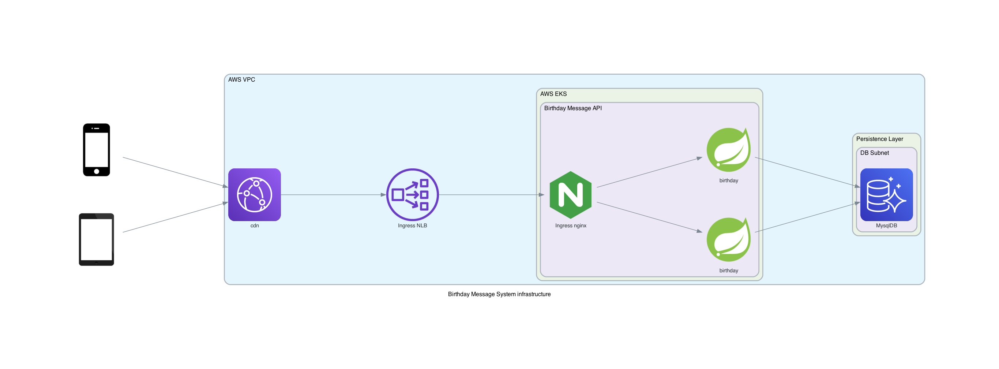

# Birthday message API

Rest service to manage user birthday.
Implementation written in Java using Spring framework. It uses Gradle for dependency management.

## Project Requirements

- Java 17
- docker - for test containers

### Compile

```bash
./gradlew build
```

### Running locally

Running locally with embebed H2 DB

```bash
./gradlew bootRun --args='--spring.profiles.active=local'
```

Running with Mysql running from TestContainers. Requires docker

```bash
./gradlew bootTestRun
```

### Test execution

#### Automated tests

```bash
./gradlew check
```

#### Manual tests

```bash
# Create new birthday
curl -X PUT --url http://localhost:8080/hello/${username} --header 'content-type: application/json' --data "{\"dateOfBirth\":\"${"YYYY-MM-DD}\"}"
```

```bash
# Retrieve birthday message
curl --url http://localhost:8080/hello/${username}
```

### Deploy

This project provides container image and kubernetes manifests to be deployed.

#### AWS System Diagram

Diagram bellow shows the AWS infrastructure design. The design and kubernetes manifest suggests the usage of Nginx ingress controller.



#### Deployment commands

It expects an existing kubernetes cluster with Ingress controller installed and configured kubeclt access.
Mysql Instance is not provisioned.
A k8s secret is created with default values for database connection.

```bash
./gradlew k8sApply
```

#### Secrets

- DATABASE_HOST
- DATABASE_USER
- DATABASE_PASS
- DATABASE_NAME

where `jdbc:mysql://${DATABASE_HOST:localhost}:${DATABASE_PORT:3306}/${DATABASE_NAME:birthday}`

## Next Steps

- Execute container image tests before publish the image
- Execute deployment test using kind
- Automatically deploy once a tag is created
